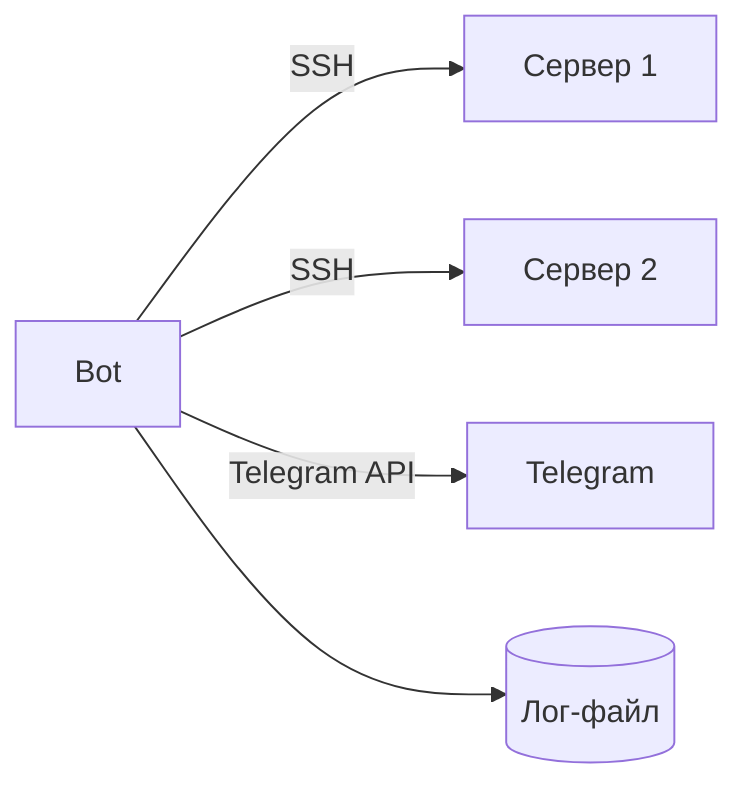

##Документация##

## О проекте
Общая информация о проекте «Издание по Интернет-безопасности для детей»:
Проект актуален как ответ на вызовы цифровой эпохи. Он решает проблему, которая затрагивает миллионы семей, используя методы, соответствующие запросам детей и подростков. Это не просто просветительская инициатива, а инструмент формирования безопасного цифрового будущего. Проект обладает высокой социальной и образовательной значимостью, что подтверждается следующими факторами:
1) Рост цифровых угроз для детей;
2) Недостаток адаптированных образовательных ресурсов;
3) Интерактивность и вовлечение;
4) Профилактика цифровых зависимостей и деструктивного поведения
5) Поддержка государственных инициатив.
6) Долгосрочный социальный эффект.

    Проект закрывает пробел между стремительной цифровизацией молодёжи и отсутствием у неё культуры безопасного взаимодействия с интернетом, предотвращая долгосрочные риски для личности и общества. Проект:

1) Трансформирует обучение в диалог через маскотов — дружелюбных персонажей, которые общаются с детьми на их языке (мемы, челленджи, истории из жизни).
2) Даёт инструменты для практики: интерактивные тесты, симуляторы киберугроз, шаблоны настройки приватности в соцсетях.
3) Обеспечивает доступность: материалы размещены на платформах, где дети проводят время (TikTok, VK, сайт с игровыми элементами).
4)Учит не страху, а осознанности: вместо запугивания показывает, как технологии могут быть безопасными и полезными.
 
Цель: проект преобразует пассивное потребление интернета детьми в осознанное и безопасное взаимодействие с цифровой средой. Это снизит текущие риски (травля, мошенничество) и заложит основу для этичного и ответственного использования технологий в будущем.
В ходе реализации проекта будет создана устойчивая экосистема цифрового просвещения, которая обеспечит:
1) Сформированную культуру безопасного поведения в интернете у целевой аудитории;
2) Доступность знаний для разных возрастов и групп;
3) Повышение вовлечённости через персонализацию;
4) Системный эффект в образовательной среде;
5) Долгосрочные изменения в обществе.

## Задание 
**1. Базовая часть задания**
Настройка Git и репозитория:

Создайте личный или групповой репозиторий на GitHub или GitVerse на основе предоставленного шаблона.
Освойте базовые команды Git: клонирование, коммит, пуш и создание веток.
Регулярно фиксируйте изменения с осмысленными сообщениями к коммитам.

**Написание документов в Markdown:**

Все материалы проекта (описание, журнал прогресса и др.) должны быть оформлены в формате Markdown.
Изучите синтаксис Markdown и подготовьте необходимые документы.

**Создание статического веб-сайта:**

Вы можете использовать только HTML и CSS для создания сайта, если освоение более сложных инструментов представляется трудным. Это делает задание доступным для студентов с базовым уровнем подготовки.
Желательно применять генераторы статических сайтов, такие как Hugo (рекомендуется), для упрощения процесса и получения дополнительных навыков. В случае выбора Hugo можно воспользоваться инструкциями из Hugo Quick Start Guide.
Создайте новый сайт об основном проекте по дисциплине «Проектная деятельность», выберите тему и добавьте контент. Оформление и наполнение сайта должны быть уникальными (не совпадать с работами других студентов) более, чем на 50%.
Сайт должен включать:
 - Домашнюю страницу с аннотацией проекта.
 - Страницу «О проекте» с описанием проекта.
 - Страницу или раздел «Участники» с описанием личного вклада каждого участника группы в проект по «Проектной деятельности».
 - Страницу или раздел «Журнал» с минимум тремя постами (новостями, блоками) о прогрессе работы.
 - Страницу «Ресурсы» со ссылками на полезные материалы (ссылки на организацию-партнёра, сайты и статьи, позволяющие лучше понять суть проекта).
Оформите страницы сайта графическими материалами (фотографиями, схемами, диаграммами, иллюстрациями) и другой медиа информацией (видео).
Взаимодействие с организацией-партнёром:

**Организуйте взаимодействие с партнёрской организацией (визит, онлайн-встреча или стажировка).**
Участвуйте в профильных мероприятиях по тематике проекта и профилю организации-партнёра (конференции, выставки, митапы, семинары, хакатоны и др.).
Уточнение: Взаимодействие осуществляется через куратора проекта по проектной деятельности, закреплённого за вашим проектом, и ответственного по проектной практике, закреплённого за учебной группой.
Напишите отчёт в формате Markdown с описанием опыта, полученных знаний и связи с проектом. Отчёт добавьте в репозиторий и на сайт.
Важно: Стажировки и экскурсии в организации-партнёры будут приниматься к зачёту и учитываться при оценке, что мотивирует к активному участию.
Отчёт по практике

**Составьте отчёт по проектной (учебной) практике на основании шаблона (структуры), размещённого в папке reports**
Шаблон (структура) приведён в файле practice_report_template.docx.
Разместите отчёт в репозитории в папке reports с именем «Отчёт.docx» или «report.docx».
Сформируйте PDF-версию отчёта и также разместите её в папке reports в репозитории.
Загрузите оба файла отчёта (DOCX и PDF) в СДО (LMS) в курсе, который будет указан ответственным за проектную (учебную) практику.

**2. Вариативная часть задания**

Была выбрана темпатика "[Телеграм бот на Python](https://www.freecodecamp.org/news/how-to-create-a-telegram-bot-using-python/)".
 2. Согласуйте внутри команды выбранную тему. Выберите стек технологий (подсказки также есть в репозитории).
 3. Проведите исследование: изучите, как создать выбранную технологию с нуля, воспроизведите практическую часть.
 4. Создайте подробное описание в формате Markdown, включающее:
   - Последовательность действий по исследованию предметной области и созданию технологии.
   - Напишите техническое руководство по созданию этой технологии, ориентированное на начинающих.
   - Включите в руководство:
     - Пошаговые инструкции.
     - Примеры кода.
   - Иллюстрации (картинки, диаграммы, схемы) в количестве от 3 до 10 штук, вставленные в текст для наглядности.
   - Поместите результаты исследования и руководства в общий Git-репозиторий.
 5. Создайте техническое руководство или туториал по созданию проекта на выбранную тему. Для визуализации архитектуры, процессов и прочего используйте разные типы диаграмм UML, схемы, графики, таблицы.
 6. Сделайте модификацию проекта согласно полученным знаниям и навыкам в течение года (творческий пункт, самостоятельно выбираете в какой части модифицировать). Описать в технической документации модификации.
 7. Сделайте видео презентацию выполненной работы (цель, задачи, как решали, демонстрация работоспособного результата).
 8. Задокументируйте проект в репозитории в формате Markdown и представьте его на сайте в формате HTML.
 9. Подготовить финальный отчет (в хронологической последовательности опишите этапы работы, отдельно должны быть представлены индивидуальные планы каждого участника).


## Что было сделанно

[Сайт](https://github.com/Igor-Zolin/monitorchiki) по проектной деятельности, а так же телеграмм бот: 

# Telegram-бот для мониторинга серверов

## Краткое техническое руководство

---

## 1. Выбор темы и стека технологий

**Тема:** Telegram-бот для мониторинга серверов с автоуправлением службами

**Стек технологий:**
- Python 3.10+
- Paramiko (SSH)
- python-telegram-bot
- asyncio
- JSON (конфигурация и логи)

---

## 2. Архитектура проекта

**Диаграмма последовательности:**


---

## 3. Пошаговая инструкция

### Шаг 1: Установка

Скачивание Fin_Server.py из [репозитория](https://github.com/ZephyrFL/MosPolyPra/blob/main/src/Fin_Server.py) и установка библеотек.

`paramiko`, `python-telegram-bot`, `asyncio`, `json`

```bash
pip install paramiko python-telegram-bot 
```

### Шаг 2: Создание Telegram-бота

1. Найти [@BotFather](https://t.me/botfather) в Telegram
2. Отправить `/newbot`
3. Получить токен

### Шаг 3: Файл конфигурации `config.json`

```json
{
    "SERVERS": [
        {
            "hostname": "192.168.1.1",
            "username": "admin",
            "password": "passwd",
            "critical_service": "nginx"
        }
    ],
    "CPU_THRESHOLD": 80,
    "MEMORY_THRESHOLD": 85,
    "TELEGRAM_TOKEN": "токен",
    "TELEGRAM_CHAT_ID": "id_чата",
    "LOG_FILE": "metrics.log"
}
```

### Шаг 4: Запуск

```bash
python3 Fin_Server.py
```

---

**Во время прохождения курса были изученны:**
- Работа с [GitHub](https://github.com/) и [GitVerse](https://gitverse.ru/);
- Разметка Markdown;
- Основные git команды;
- Разметка HTML и CSS стили;
- Работа с библиотеками Python.

**А так же были написанны**
- Сайт по проектной деятельнсти;
- Python бот для мониторинга сервера хоста;
- Документация по ПД и ПП.


